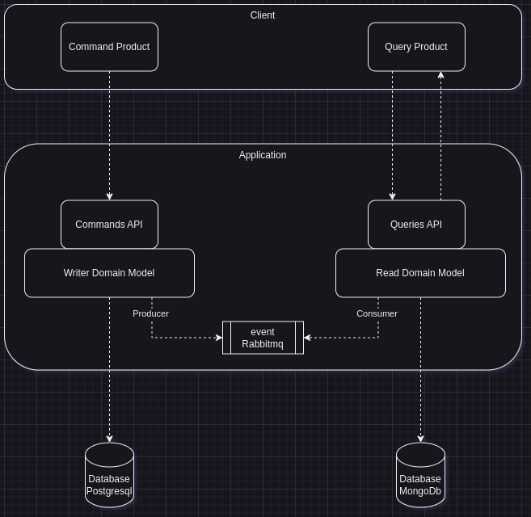
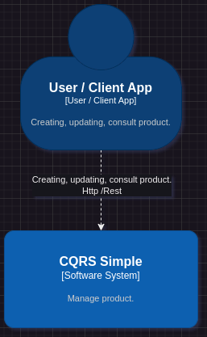
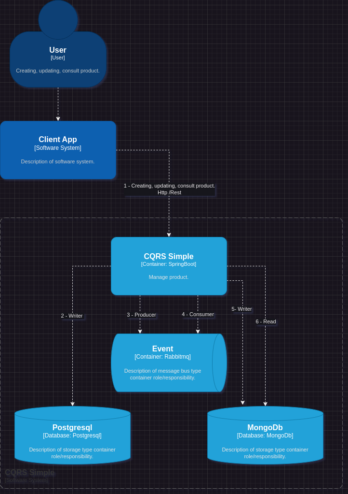
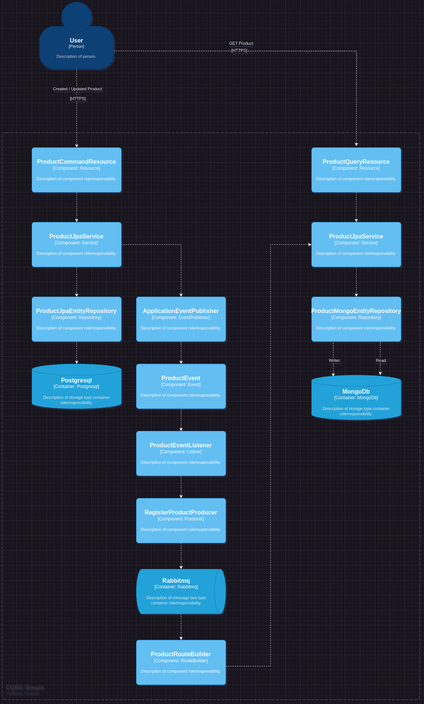

# CQRS Simple

## Índice

- [Product](#cqrs-simple)
    - [Índice](#índice)
    - [Visão geral do produto](#visão-geral-do-produto)
    - [Tecnologias](#tecnologias)
    - [Requisitos para Desenvolvimento](#requisitos-para-desenvolvimento)
    - [Esboço](#esboço)
    - [Diagrama de Contexto](#diagrama-de-contexto)
    - [Diagrama de Container](#diagrama-de-container)
    - [Diagrama de Component](#diagrama-de-component)

## Visão geral do cqrs-simple

O **CQRS Simple** é um microsserviço responsável por gerenciar produto

## Tecnologias

Abaixo, apresenta-se as ferramentas utilizadas nesse projeto:

- [Java 17](https://www.oracle.com/br/java/technologies/downloads/#java17)
- [Maven 3.6.x+](https://maven.apache.org/)
- [Spring Boot 3.1.2.RELEASE](https://spring.io/projects/spring-boot)
- [Apache Camel 4.0.0-SNAPSHOT](https://camel.apache.org/)
- [Rabbitmq](https://www.rabbitmq.com)
- [MongoDb](https://www.mongodb.com)
- [Postgresql](https://www.postgresql.org)

## Requisitos para Desenvolvimento
- Java 17
- Maven 3.x.x+
- Rabbitmq
- MongoDb
- Postgresql

## Esboço

## Diagrama de Contexto

## Diagrama de Container

## Diagrama de Component
